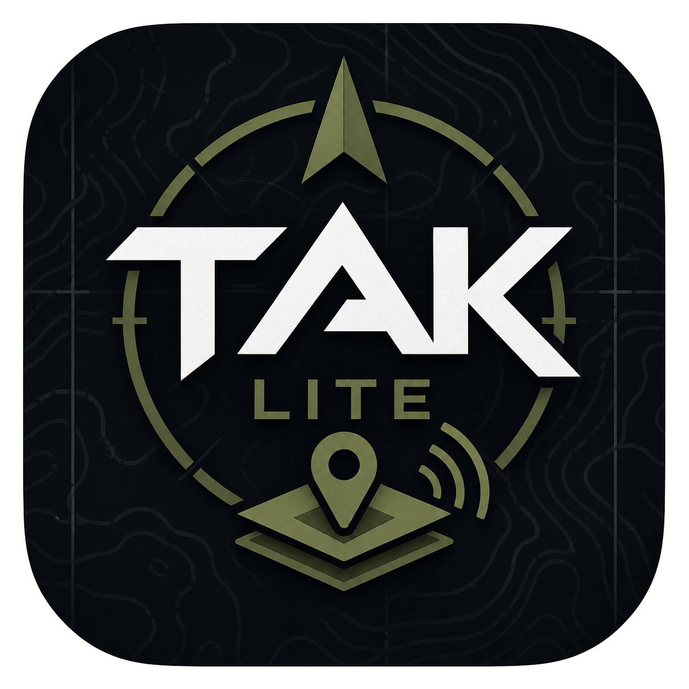
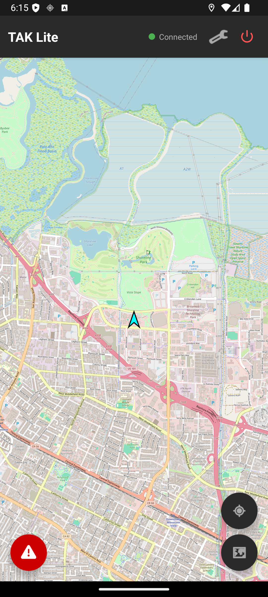
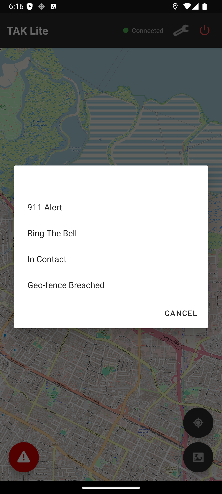

  

<h1 align="center">TAK Lite</h1>

  A lightweight TAK client for Android

---

## About

TAK Lite is a minimalist [TAK](https://tak.gov) client that connects to TAK servers over TLS, shares your position with teammates, and displays everyone on a real-time map. It's designed to be simple and fast — no bloat, just the essentials.

## Features

- **TAK Server Connectivity** — TLS/TCP connection to any TAK server
- **QR Code Enrollment** — Scan an ATAK/iTAK enrollment QR to auto-configure
- **Manual Enrollment** — Username/password enrollment with certificate download
- **Position Reporting (PLI)** — Sends your location every 5 seconds, including in the background
- **Team Tracking** — See all connected team members on an OpenStreetMap-based map
- **Emergency Alerts** — Send and receive alerts: 911, Ring the Bell, Troops in Contact, Geofence Breach
- **Hardware Panic Button** — Trigger an alert by pressing the power button 3 times
- **Group Assignment** — Fetch and assign server groups
- **Multiple Map Layers** — Street, satellite, hybrid, and topographic views
- **14 Team Colors** — Cyan, Red, Blue, Green, Yellow, Orange, White, Purple, Maroon, Dark Blue, Dark Green, Teal, Brown, Magenta
- **6 Roles** — Team Member, Team Lead, HQ, Sniper, Medic, RTO

## Screenshots

  
  &nbsp;&nbsp;
  
  &nbsp;&nbsp;
  

## Requirements

- Android 7.0 (API 24) or higher
- Location permissions (foreground and background)
- A TAK server to connect to

## Installation

1. Download the latest APK from the [Releases](https://github.com/RyanR3/TAKLite/releases) page
2. Install the APK on your Android device
3. Open TAK Lite, go to Settings, and configure your callsign
4. Scan a QR enrollment code or manually enter server details
5. You're on the map

## License

All rights reserved.
