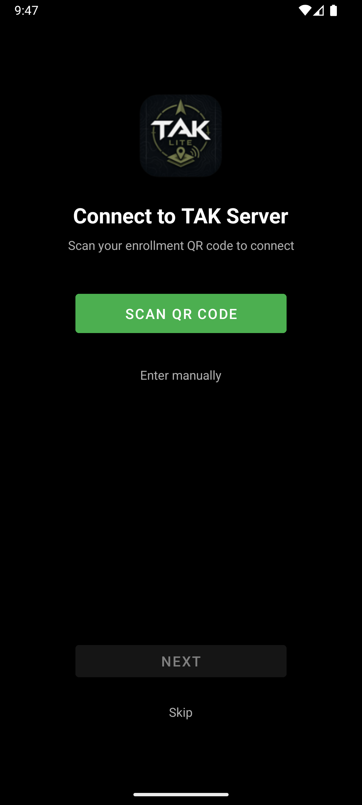
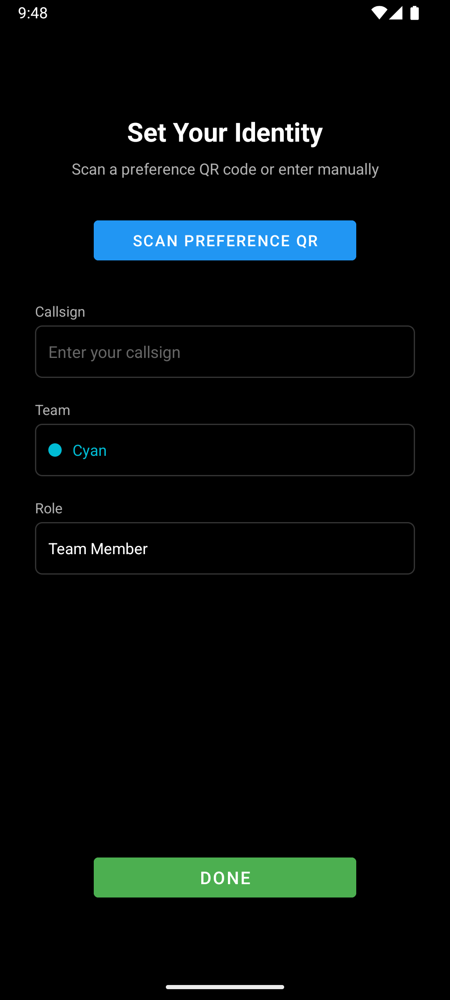
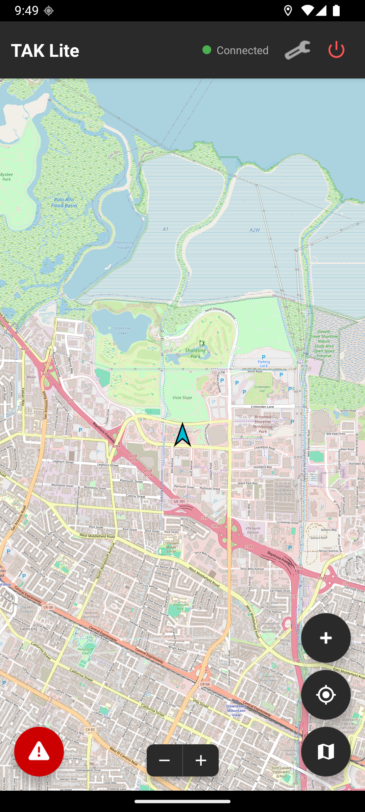
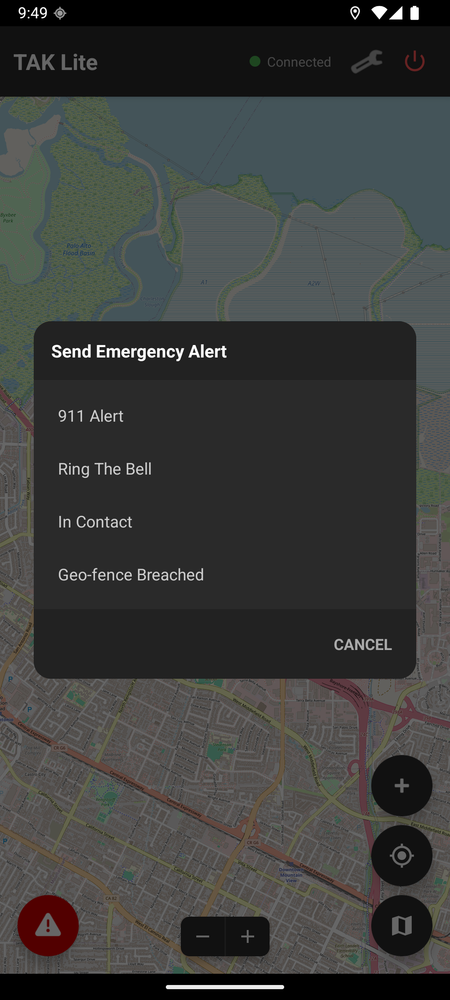
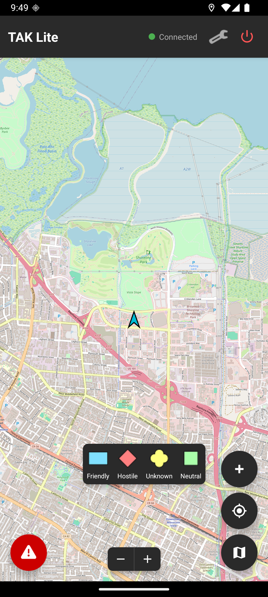
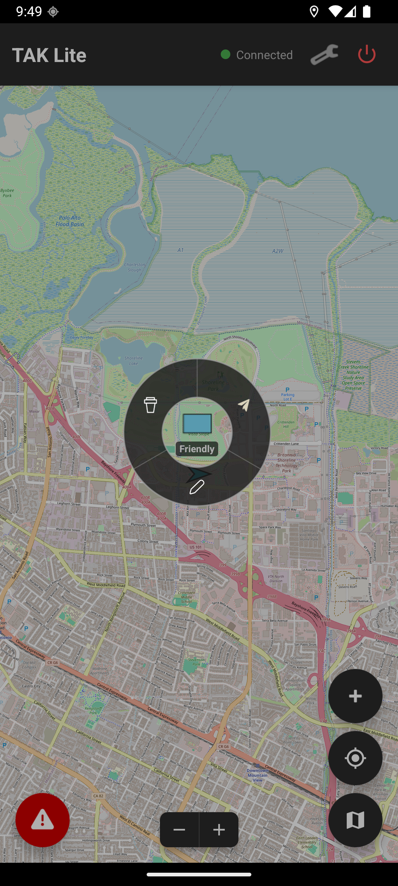
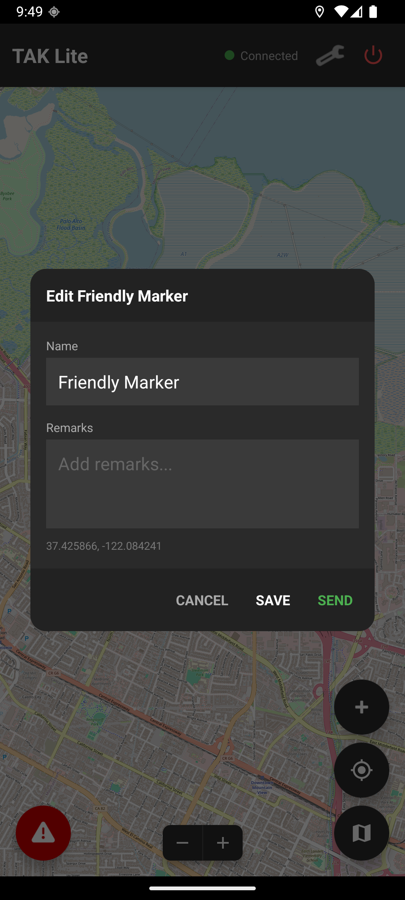
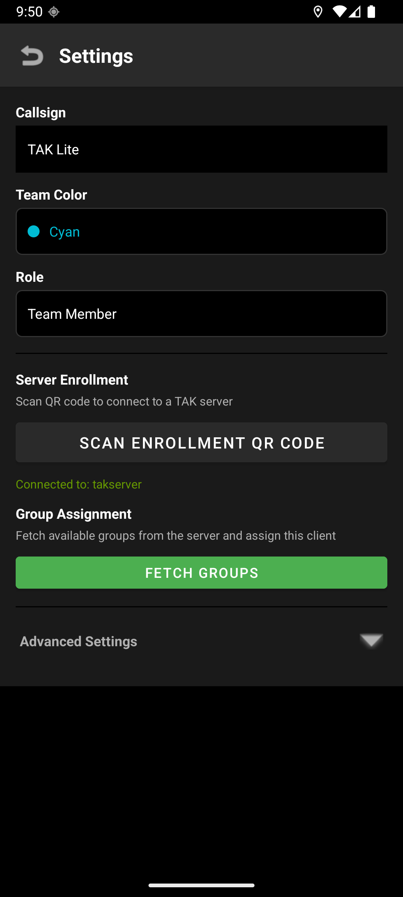

  

<h1 align="center">TAK Lite</h1>

  A lightweight TAK client for Android

---

> **NOTICE:** Version 1.4.2 uses a new signing key. If you have a previous version installed, you must **uninstall it first** before installing this update. A fresh install is required.

---

## About

TAK Lite is a minimalist [TAK](https://tak.gov) client that connects to TAK servers over TLS, shares your position with teammates, and displays everyone on a real-time map. It's designed to be simple and fast — no bloat, just the essentials.

## Features

- **Onboarding Wizard** — Guided first-time setup with QR code or manual entry
- **TAK Server Connectivity** — TLS/TCP connection to any TAK server
- **QR Code Enrollment** — Scan an ATAK/iTAK enrollment QR to auto-configure
- **Manual Enrollment** — Username/password enrollment with certificate download
- **Position Reporting (PLI)** — Sends your location every 5 seconds, including in the background
- **Team Tracking** — See all connected team members on an OpenStreetMap-based map
- **Emergency Alerts** — Send and receive alerts: 911, Ring the Bell, Troops in Contact, Geofence Breach
- **Incoming Alert Popup** — Full-screen alert dialog with alarm sound when a teammate triggers an emergency
- **Locate on Alert** — Instantly zoom to a teammate's position from an incoming alert
- **Background Alerts** — Receive emergency alerts with alarm and lock screen notification even when the app is minimized
- **Hardware Panic Button** — Trigger an alert by pressing the power button 3 times
- **Marker Drops** — Place Friendly, Hostile, Unknown, and Neutral markers using MIL-STD-2525 icons
- **Radial Menu** — ATAK-style radial menu on markers with Delete, Send, and Edit actions
- **Marker Editing** — Rename markers, add remarks, and send to TAK server
- **Persistent Markers** — Dropped markers survive app restarts
- **Group Assignment** — Fetch and assign server groups
- **Multiple Map Layers** — Street, satellite, hybrid, and topographic views
- **14 Team Colors** — Cyan, Red, Blue, Green, Yellow, Orange, White, Purple, Maroon, Dark Blue, Dark Green, Teal, Brown, Magenta
- **6 Roles** — Team Member, Team Lead, HQ, Sniper, Medic, RTO

## Screenshots

  
  &nbsp;&nbsp;
  
  &nbsp;&nbsp;
  

  
  &nbsp;&nbsp;
  
  &nbsp;&nbsp;
  

  
  &nbsp;&nbsp;
  

## Requirements

- Android 8.0 (API 26) or higher
- Location permissions (foreground and background)
- A TAK server to connect to

## Installation

1. Download the latest APK from the [Releases](https://github.com/RyanR3/TAKLite/releases) page
2. Install the APK on your Android device
3. Follow the onboarding wizard to connect to your TAK server
4. Set your callsign, team, and role
5. You're on the map

## License

All rights reserved.
